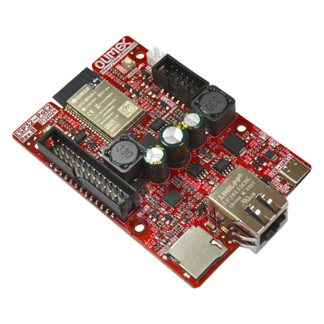

# ESP32-POE2
Power Over Ethernet Internet of Things POE IoT board with Espressif ESP32 WiFi, Bluetooth and wired 100Mbit Ethehernet with 25W power delivery

https://www.olimex.com/Products/IoT/ESP32/ESP32-POE2/open-source-hardware

## Licensee
* Hardware is released under CERN Open Hardware Licence Version 2 - Strongly Reciprocal
* Software is released under GPL V3 Licensee
* Documentation is released under CC BY-SA 4.0